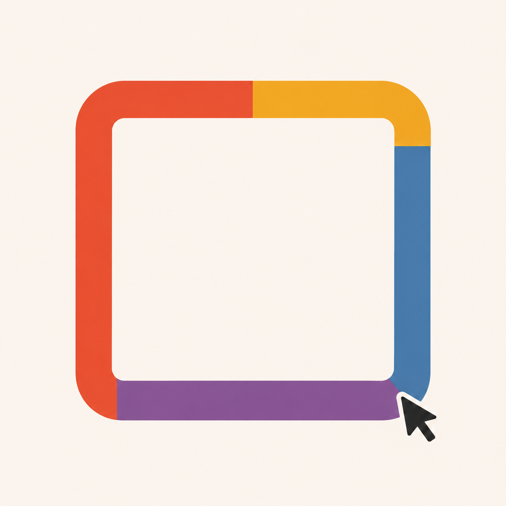
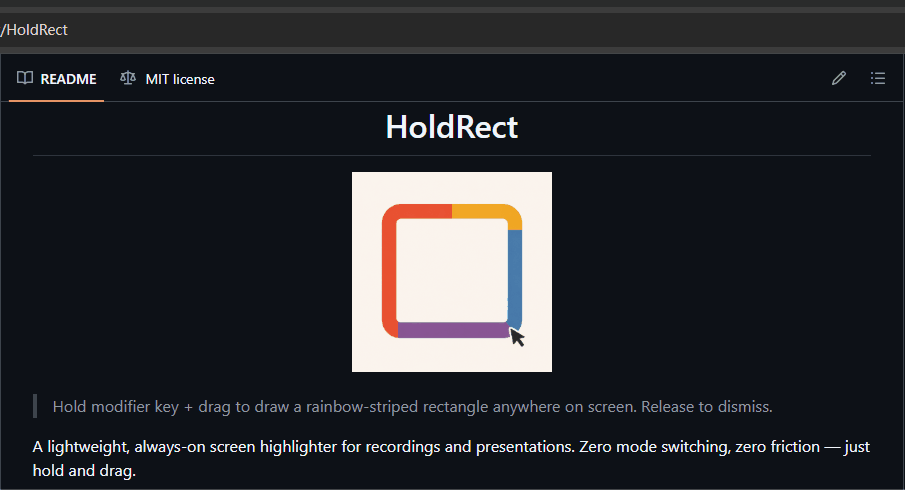

<h1 align="center">HoldRect</h1>

<p align="center">
  
</p>

<p align="center">
  <strong>Hold Alt + drag to highlight any screen area. Release to dismiss.</strong><br>
  A lightweight screen highlighter for recordings, presentations, and live demos — under 2 MB, near-zero memory.
</p>

---

## Why HoldRect?

Recording your screen and need to highlight something **right now**?

Switching to an annotation tool, picking a shape, drawing, then switching back — your audience stopped watching 10 seconds ago.

**HoldRect has no modes to switch.** Hold `Alt`, drag a rectangle, done. Release and it vanishes. Your recording flow never breaks.

And it won't fight your recorder for RAM — under 2 MB binary when it's on background. You will forget it when you're not using it.

<p align="center">
  
</p>

## Features

| | Feature | What it does |
|---|---|---|
| ⚡ | **Zero-mode interaction** | Hold `Alt` + left-click drag. No toolbar, no hotkey sequence, no mode toggle. |
| 🌈 | **Rainbow animated border** | Gradient flows along the rectangle perimeter. Unique to HoldRect. |
| 📌 | **Pin & Spotlight** | Press `1` during drag to pin the rectangle. Press `2` to dim everything outside. Toggle anytime. |
| 🔍 | **Magnifier** | Press `3` to zoom into the area under cursor. Scroll to adjust zoom. |
| 🖥️ | **Under 2 MB** | Rust native binary. No runtime, no Electron, no installer bloat. |

## Quick Start

```powershell
irm https://raw.githubusercontent.com/WodenJay/HoldRect/main/install.ps1 | iex
```

Then hold `Alt` + drag anywhere. That's it.

| Action | Shortcut |
|--------|----------|
| Draw a rectangle | `Alt` + drag |
| Pin rectangle on screen | `Alt` + `1` + drag (`Esc` to clear) |
| Spotlight (dim outside) | `Alt` + `2` + drag |
| Both pin + spotlight | `Alt` + `1` + `2` + drag |
| Magnifier | `Alt` + `3` (scroll to zoom) |
| View all shortcuts | Hold `` Alt + ` `` |

## CLI / AI Control

The same `holdrect.exe` can control the resident overlay from scripts and AI tools. A command automatically starts HoldRect when it is not already running.

```powershell
holdrect rect 100 200 500 400
holdrect magnifier 800 450
holdrect magnifier 800 450 3
holdrect clear
```

- `rect x1 y1 x2 y2` adds a rectangle that remains until `clear`.
- `magnifier x y [zoom]` shows one fixed magnifier; zoom defaults to `2.0` and accepts `1.5` through `8.0`.
- `clear` removes all pinned/fading rectangles, cancels the active drawing, and hides the magnifier.

Coordinates are signed physical pixels in the Windows virtual-desktop coordinate space, so monitors left of the primary display can use negative `x` values.

## Installation

### One-liner

```powershell
irm https://raw.githubusercontent.com/WodenJay/HoldRect/main/install.ps1 | iex
```

### Manual

1. Download `holdrect.exe` from [Releases](https://github.com/WodenJay/HoldRect/releases/latest)
2. Run it — a tray icon appears, HoldRect is now listening
3. To exit: right-click the tray icon → **Exit**

## Configuration

HoldRect reads `~/.holdrect/config.toml`:

```toml
[general]
modifier = "Alt"              # Alt / Ctrl / Shift / Win
border_width = 4              # pixels
color = "rainbow"             # "rainbow" or hex like "#ff0000"
```

## How It Works

```
Modifier down → Left-click down → Drag (rectangle follows cursor)
                                    ├─ press 1: toggle Pin
                                    ├─ press 2: toggle Spotlight
                                    ├─ press 3: toggle Magnifier
                                    └─ press 1 + 2: both active
              → Mouse up
                  ├─ Transient (default): rectangle vanishes
                  └─ Pinned: rectangle stays, Esc clears all
              → Modifier up: magnifier vanishes
```

Each rectangle's Pin/Spotlight state is independent — drawing a new one resets to transient.

## Competitive Landscape

| Tool | Open Source | Memory | Animated Border | Zero Mode Switch | Cross-Platform |
|------|:-----------:|-------:|:---------------:|:----------------:|:--------------:|
| **HoldRect** | ✓ | **< 2 MB** | **✓ rainbow** | **✓** | Planned |
| Epic Pen | ✗ | ~20–50 MB | ✗ | ✗ | ✗ (Win) |
| ZoomIt | ✗ | ~10–15 MB | ✗ | ✗ (Ctrl+2) | ✗ (Win) |
| gInk | ✓ | ~15–30 MB | ✗ | ✗ | ✗ (Win) |
| Gromit-MPX | ✓ | ~5–10 MB | ✗ | ✗ | ✗ (Linux) |
| Fluor | ✓ | ~85 MB | ✗ | ✗ | ✗ (macOS) |

## Building from Source

```bash
git clone https://github.com/WodenJay/HoldRect.git
cd HoldRect
cargo build --release
```

Requires Rust 1.75+ and Windows 10+.

## Issues

I built this project in my spare time because I needed it myself. HoldRect is only on windows now because I'm using windows. If you need a feature, find a bug or need Linux/MacOS, please open an issue. I will handle it if I have time.

## License

MIT
